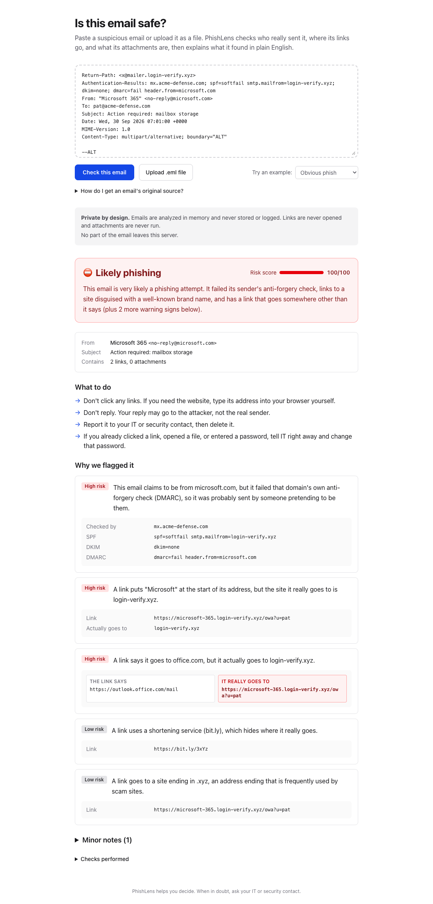
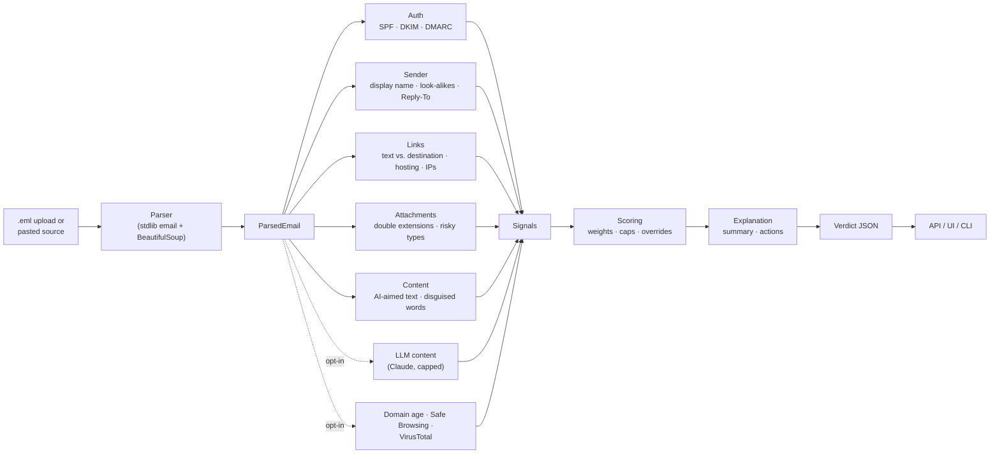

# PhishLens

**Paste a suspicious email, get a plain-English answer: is it phishing, why, and what to do.**

PhishLens is built for the people at a small defense contractor who get the email: not a
SOC, but an engineer or office manager deciding whether to click. It checks who really sent
the message, where its links go, and what its attachments are, then explains each finding
with the evidence to back it up.



## Quick start

Requires [uv](https://docs.astral.sh/uv/) and Node 20+.

```bash
make dev          # installs dependencies, starts the API on :8000 and the UI on :3000
```

Open http://localhost:3000 and pick an example from **Try an example**, or paste an email's
original source. Other entry points:

```bash
make demo                                                        # three demo cases in the terminal
make serve                                                       # production mode: one server on :8000
cd backend && uv run python -m phishlens analyze message.eml    # CLI; add --json for the API shape
curl -X POST localhost:8000/api/analyze -H 'Content-Type: message/rfc822' --data-binary @message.eml
make test                                                        # backend tests + frontend checks
make eval                                                        # evaluation on public corpora
docker compose up --build                                        # the production container on :8000
```

Out of the box everything runs **offline**: no part of an email leaves the machine. The
optional checks below are off until configured.

## How it works



1. **Parse.** Raw source becomes a `ParsedEmail`: decoded headers, bodies, every link as a
   *(visible text, real destination)* pair, and attachments with SHA-256 hashes. The parser
   is forgiving on purpose, because phishing is often malformed on purpose. It recovers
   what it can and records what was wrong.
2. **Analyze.** Independent analyzers run in parallel under one deadline. Each returns
   `Signal`s: a stable id, a severity, a weight, the exact evidence, and one plain-English
   sentence. An analyzer that crashes or times out is reported as "didn't run"; it never
   blocks the verdict.
3. **Score.** Weights (from [`signals.toml`](backend/src/phishlens/signals.toml)) are
   summed to 0–100: ≥ 20 is *suspicious*, ≥ 50 is *phishing*. One strong signal makes an email
   suspicious; two independent ones make it phishing. A few hard overrides (a disguised
   executable, a threat-list hit) force *phishing*. All numbers live in
   [`scoring.toml`](backend/src/phishlens/scoring.toml).
4. **Explain.** The top reasons become a one-sentence summary, plus actions that fit the
   email (link advice only if it has links, "don't reply" if replies are redirected, and so on).

The contracts (`ParsedEmail`, `Signal`, `Verdict`) are Pydantic models in
[`models.py`](backend/src/phishlens/models.py). Everything else plugs into them.

## What it checks

| Check | Examples of what it catches | Runs |
|---|---|---|
| **Sender verification** | DMARC/SPF/DKIM failures from the receiving server's `Authentication-Results` | Offline |
| **Sender identity** | "Microsoft 365" from a non-Microsoft domain; `paypa1.com`, `rnicrosoft.com`, `sam-gov-renewal.com`; your own company's name or "IT Helpdesk" from an outside domain; replies redirected to Gmail | Offline |
| **Links** | Link text that says one thing and goes elsewhere; brand in a subdomain (`microsoft.login-secure.xyz`); punycode; raw IPs; `paypal.com@evil.com`; shorteners; free hosting (IPFS, r2.dev, vercel.app); forms asking for passwords | Offline |
| **Attachments** | `invoice.pdf.exe`; right-to-left-override filenames; HTML/SVG, ISO, macro Office and OneNote files; declared type ≠ extension | Offline |
| **Content** | Hidden text aimed at AI scanners; your address in the subject; words disguised with Cyrillic look-alikes or zero-width characters | Offline |
| **AI content check** | Credential and payment requests, pressure, callback scams, CEO fraud | `PHISHLENS_LLM=on` + `ANTHROPIC_API_KEY` |
| **Domain age** | Sender or link domains registered in the last 30/90 days (RDAP) | `PHISHLENS_RDAP=on` |
| **Google Safe Browsing** | Links on Google's phishing and malware lists | `GOOGLE_SAFE_BROWSING_API_KEY` |
| **VirusTotal** | Attachments known to antivirus engines, by hash | `VIRUSTOTAL_API_KEY` |

The brand list includes the services small defense contractors depend on and get phished
with: **SAM.gov**, **Login.gov**, and **PIEE/WAWF**, alongside Microsoft, DocuSign and the usual
targets.

## Design decisions

**Deterministic rules are the backbone; the LLM is a capped assistant.** Every rule is
testable and explainable and gives the same answer every time. The LLM covers what rules
can't (the *wording* of a CEO-fraud request), but it can only add evidence, never decide the
verdict.

**The email is attacker-controlled input to the LLM, so the design assumes it can be
manipulated.**
- The email sits inside `<email-{random nonce}>` tags, so it can't forge the closing tag.
- The model can only answer with structured findings from a fixed list: no verdict field,
  no free text.
- Every quote and company name it returns must appear in the email, or it is dropped, so the
  UI never shows invented text.
- It can only *raise* the score, and by at most 25 points (`scoring.toml`). On its own it can
  reach *suspicious*, never *phishing*.
- A separate deterministic check flags "ignore previous instructions" style text, including
  inside HTML comments, without trusting the model.

The test suite proves the worst case: with a model that is completely fooled, the
prompt-injection sample is still labeled phishing.

**No suspicious URL is ever fetched and no attachment is ever opened or uploaded.** Links
are analyzed as text. Reputation services receive only a domain name (RDAP), a URL with its
query string and fragment removed (Safe Browsing: these often carry the recipient's address or
a sign-in token), or a SHA-256 hash (VirusTotal: uploading would share a possibly confidential
document with every VirusTotal subscriber). The UI shows links as plain text, never as
clickable anchors.

**Nothing leaves the machine unless an administrator opts in.** For a defense contractor,
an email can contain Controlled Unclassified Information. Sending it to a third-party API
may conflict with DFARS 252.204-7012 / NIST SP 800-171 obligations, so every external call is
off by default, and the UI states exactly what is sent where when one is on.

**Nothing is stored.** The API reads the request body as a stream into memory, with a 10 MB
cap. It deliberately doesn't accept multipart uploads, because those spool large files to
temporary files on disk. It logs only the label and score (a test enforces that email content
never reaches the logs) and returns `Cache-Control: no-store`.

**Authentication results are only as trustworthy as whoever wrote them.** Anyone can add a
fake `dmarc=pass` header. PhishLens reads the topmost `Authentication-Results`, which is
written by the receiving server, or the first one from your own servers if
`PHISHLENS_TRUSTED_AUTHSERV_IDS` is set. It also handles Microsoft 365's variant format.

**A DMARC pass proves who sent it, not that they're honest.** Attackers pass DMARC on
their own look-alike domains, so trust signals are ignored whenever a high-severity signal is
present. The UI shows them as a neutral note, never as a green "good sign" on a phish.

**False positives are the headline metric.** Repeated problems count once (40 tracked links
in a newsletter are one issue, not 40). Rules that fire on ordinary mail were narrowed
(harmless search boxes, a newsletter's own click tracker) and have tests for the legitimate
cases they must not flag.

## Evaluation

On a held-out test split of 640 recent phishing emails
([Nazario corpus](https://monkey.org/~jose/phishing/), 2023–2025) and 1,404 legitimate ones
([SpamAssassin ham](https://spamassassin.apache.org/old/publiccorpus/)), offline checks only:

| | False positive rate | Precision | Recall |
|---|---|---|---|
| Flagged (suspicious or phishing) | **2.2%** | 91.7% | 53.6% |
| Labeled *phishing* | **0.0%** (0 of 1,404) | 100% | 9.4% |

Rules were tuned only on a separate dev split. Before tuning, the same test split scored 5.5%
false positives and 22.7% recall. About half the misses have no technical red flag at all: the
scam is purely in the wording, which is the LLM analyzer's job and wasn't evaluated (no API
key). The legitimate corpus is from 2002 and predates DMARC. [eval/README.md](backend/eval/README.md)
covers the method, error analysis and limitations; [eval/RESULTS.md](backend/eval/RESULTS.md)
has the full generated report.

To measure the AI content check on a fixed random sample (costs roughly one Claude request per
email; it asks for confirmation first):

```bash
ANTHROPIC_API_KEY=... make eval-llm      # 100 phishing + 100 legitimate -> eval/RESULTS_LLM.md
```

The report compares the same emails with and without the AI check.

## Hosting

Production is **one container** ([Dockerfile](Dockerfile)): the UI is exported as static
files and served by FastAPI next to `/api/*`, so there is one service, one origin, and no CORS.
CI builds the image and smoke-tests it (UI, health, manifest, a real analysis) on every push.

**Render (free tier), using the included [render.yaml](render.yaml) Blueprint:**

1. Push this repository to GitHub.
2. In Render: **New → Blueprint**, pick the repository. Render asks for the `sync: false` values:
   - `PHISHLENS_ACCESS_CODE`: **set this** for any public URL; without it anyone can use the service.
   - `PHISHLENS_PUBLIC_URL`: the service URL, e.g. `https://phishlens.onrender.com`
     (you can fill it in after the first deploy shows the URL; it's used by the Outlook manifest).
   - API keys: leave empty to keep everything offline.
3. Deploy, then open the URL. Free services sleep after inactivity, so the first request can
   take about a minute.

Any other Docker host (Fly.io, Railway, Cloud Run, Azure Container Apps) works the same way:
run the image, set `PORT` if the platform requires one, and set `PHISHLENS_PROXY_HOPS=1` when
it sits behind a single reverse proxy.

**Abuse controls.** `/api/analyze` is rate-limited per client address (default 30 a minute;
`PHISHLENS_RATE_LIMIT`). The limit counts wrong access codes too, so the code can't be
brute-forced. The client address comes from `X-Forwarded-For` only for the configured number of
trusted proxy hops, counted from the right, because clients control the left part. The limiter
is in memory, which suits one instance; several instances would need a shared store such as
Redis.

## Outlook add-in

Users can check an email without copying its source: a **Check for phishing** button in
Outlook opens a PhishLens pane for the open message.

- The manifest is served by the deployment itself: `https://<your-url>/outlook/manifest.xml`.
  It needs HTTPS, so use the hosted URL.
- **Try it yourself:** in Outlook on the web, open *Get Add-ins → My add-ins → Add a custom
  add-in → Add from URL* (or from a file after downloading the manifest).
- **Roll out to everyone:** Microsoft 365 admin center → *Settings → Integrated apps → Upload
  custom apps*.
- The pane reads the original message with Office.js (`getAsFileAsync`, Mailbox 1.14). On
  older Outlook builds it rebuilds the message from its internet headers and HTML body, so
  sender and link checks still work but attachments aren't included. It re-checks when the
  user moves to another email, and remembers the access code on that device.
- It needs only `ReadItem` permission and sends the message to your PhishLens deployment only.
- I couldn't test it inside Outlook (no Microsoft 365 account on the build machine). The pane
  and its security headers are tested in a browser, and the manifest follows Microsoft's
  add-in schema.

## Configuration

| Variable | Effect |
|---|---|
| `PHISHLENS_LLM=on` | Enable the AI content check (needs Anthropic credentials, e.g. `ANTHROPIC_API_KEY`) |
| `PHISHLENS_LLM_MODEL` | Model id (default `claude-opus-5-5`, low effort) |
| `PHISHLENS_TRUSTED_AUTHSERV_IDS` | Comma-separated names of your mail servers; only their `Authentication-Results` are trusted |
| `PHISHLENS_RDAP=on` | Enable domain-age lookups |
| `GOOGLE_SAFE_BROWSING_API_KEY` | Enable Safe Browsing lookups |
| `VIRUSTOTAL_API_KEY` | Enable VirusTotal hash lookups |
| `PHISHLENS_ACCESS_CODE` | Require this code for analysis (the UI asks for it) |
| `PHISHLENS_RATE_LIMIT` | Analyses per client, e.g. `30/minute` (default) |
| `PHISHLENS_PROXY_HOPS` | Number of trusted reverse proxies in front (Render: `1`) |
| `PHISHLENS_PUBLIC_URL` | Public HTTPS URL, used in the Outlook manifest |
| `PHISHLENS_STATIC_DIR` | Serve the exported UI from this folder (set in the Docker image) |
| `PHISHLENS_API_URL` | Development only: where `next dev` forwards `/api/*` (default `http://127.0.0.1:8000`) |

`GET /api/health` reports which optional checks are on and whether a code is needed, without
revealing keys.

## Project layout

```
backend/
  src/phishlens/
    models.py        contracts: ParsedEmail, Signal, Verdict
    parser.py        raw email -> ParsedEmail
    analyzers/       auth, sender, urls, attachments, content, llm, domain_age, safe_browsing, virustotal
    domains.py       registered domains, look-alikes, homoglyph skeletons
    knowledge.py     brands, free-mail and hosting providers, risky extensions
    signals.toml     severity, weight and summary phrase for every signal
    scoring.toml     thresholds, analyzer caps, hard overrides
    scoring.py, explain.py, engine.py, api.py, __main__.py (CLI)
  tests/             300+ tests; fixtures/ holds the sample emails
  eval/              corpus download, evaluation script, results
frontend/            Next.js UI; /outlook is the Outlook add-in pane
Dockerfile           production image: static UI + API in one container
render.yaml          Render Blueprint
.github/workflows/   CI: tests, lint, build, container smoke test
```

## What I'd do with more time

- **Run the LLM evaluation** (`make eval-llm`, ready to go) on the 140 "no technical red flag"
  misses and on modern legitimate mail, and measure its cost and latency per email.
- **A modern legitimate corpus.** 2002 mail can't test DMARC or today's marketing mail. I'd
  gather opt-in samples from a pilot customer.
- **Deeper Microsoft 365 integration.** The Outlook add-in exists; next would be a
  "Report phishing" action that also forwards to IT, and deployment inside GCC or GCC High, where
  most small defense contractors live. That also settles where an LLM could run (e.g. Azure
  OpenAI or Bedrock in GovCloud). A Gmail add-on would cover Google Workspace shops.
- **Use the organization's own context:** known vendors and their payment domains, first-time
  senders, executive names for impersonation checks, and learned per-tenant allow lists.
- **Attachment content analysis** in a sandbox: PDFs with links and QR codes, macros, and
  HTML attachments' embedded forms.
- **Calibrate** the weights (e.g. logistic regression over signals on a modern corpus) instead
  of hand-set numbers, while keeping them readable.
- **Operational hardening:** single sign-on (Entra ID) instead of a shared access code, a
  shared rate-limit store for multiple instances, audit logging of verdicts, and image
  scanning in CI.

## How AI tools were used

<!-- Written by Claude Code at the author's request. Rewrite this section in your own words
     before submitting: reviewers will ask about it. -->

This project was built with **Claude Code** (Anthropic's coding agent) working through a
phased plan the author wrote: the stack, the phase order, and the priorities (security
judgment, plain-English explanations, a defensible design). Each phase ended with a summary of
decisions and trade-offs, and the next phase started only after the author approved it.

- **AI wrote most of the code and tests**, and proposed several design choices that the author
  reviewed at phase boundaries: negative-weight trust signals and when to ignore them, streaming
  the request body instead of multipart, making every external call opt-in because of CUI,
  treating the recipient's own organization as a brand to catch look-alikes, and quote
  verification for LLM output.
- **Testing caught AI mistakes and real bugs**, and those fixes are in the history. Examples:
  Microsoft 365's `Authentication-Results` format broke the auth parser; the UI showed an
  attacker's DMARC pass as a green "good sign"; rules that flagged `sign-ups.com` as UPS or
  newsletters' search boxes as credential forms.
- **The evaluation guarded against the AI fooling itself:** tuning on a dev split, one final
  run on a held-out test split, and an honest limitations section.

## Attribution

Phishing evaluation data: Jose Nazario, *phishing corpus*, [CC BY 4.0](https://creativecommons.org/licenses/by/4.0/).
Legitimate evaluation data: Apache SpamAssassin public corpus. Neither dataset is
redistributed here; `make eval` downloads them.
